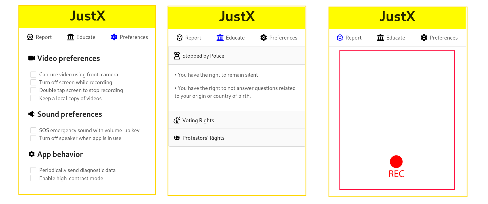

# JustX

In the last couple of years, a bright light has been shed on the various forms of injustices and human rights violations that occur worldwide. Although injustice isn't new, the technology we have access to now is. Various apps, such as Instagram and Twitter, have given people the ability to broadcast what occurs to them in real time, often leading to more awareness and justice. However, the current platforms we use can only go so far. In this day and age, we are in need of a platform that helps to not only bring better awareness to the plights of the oppressed, but also to empower and inform them with the tools they need to level the playing field. We aim to fill this gap with JustX, an app with the goal of educating the global community. When knowledge is put into the hands of the people, power is taken out of the hands of those who oppress them.

# App screens



## Starting up the app

In the project directory, you can install all dependencies with:

```
yarn install
```

And then:

```
yarn start
```

Runs the app in the development mode.\
Open [http://localhost:3000](http://localhost:3000) to view it in the browser.

The page will reload if you make edits.\
You will also see any lint errors in the console.
